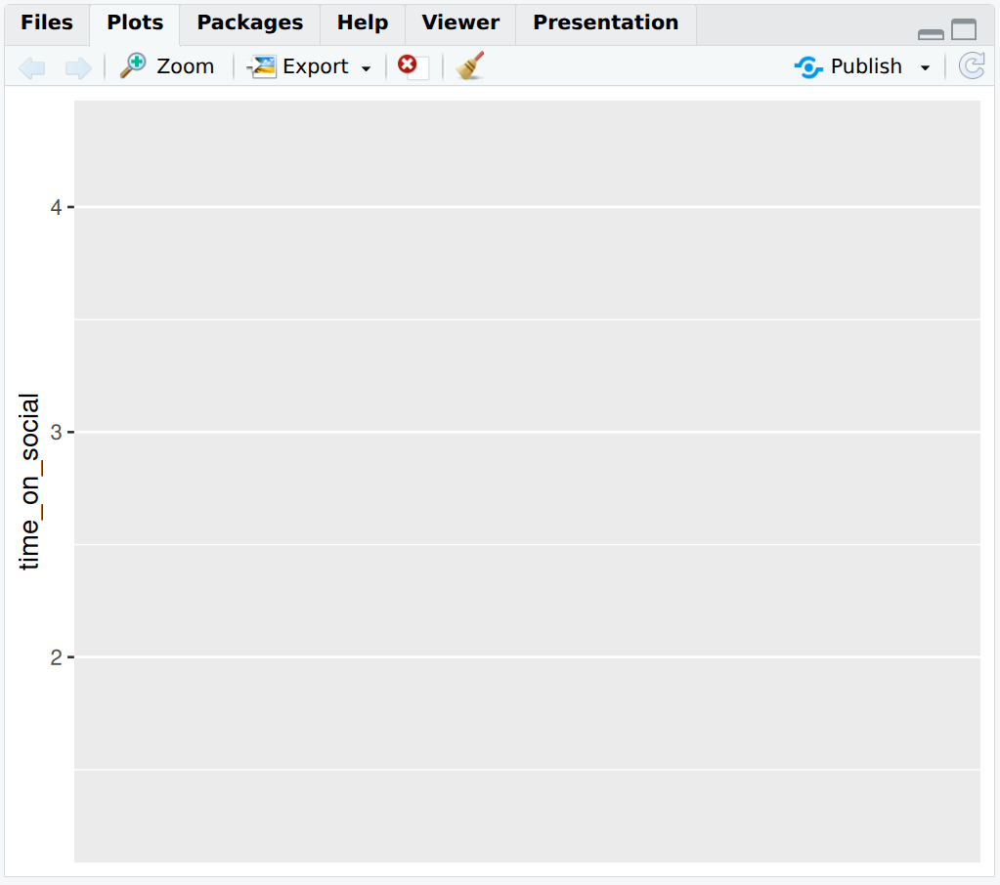

# Data wrangling and visualisation

Data analysis in Psychology and any other discipline is 90% data wrangling and 10% actual analysis. This week we will start to understand how to manipulate and visualise data using R.

> As usual, download the zipped lab folder from the Moodle page for this week and unzip it somewhere sensible on your computer. Double click the `.Rproj` file to open RStudio, and open the`.R` script file to get started.

## Checking installation and loading packages

Before we can **begin** any script we first need to make sure that the **required packages are installed** in our version of RStudio. Next, we can **load the required packages** to be used in the script, using the `library()` function. 

> Copy and paste the code block below into your script in RStudio and try running it. If you need a reminder on how to run a piece of code then check back to Section \@ref(sec-run-code).

R Coders always start their scripts by loading all the packages need to run all the code contained within the script.

### Activity -  Load your packages

```{r  message = FALSE, warning= FALSE}
# Check if packages are installed, if not install.
if(!require(here)) install.packages('here') #checks if a package is installed and installs it if required.
if(!require(tidyverse)) install.packages('tidyverse')

library(here) #loads in the specified package
library(tidyverse)
```

Note that in the code above, we've added a fancy `if()` statement to check if the packages are installed. `if()` will check the statement inside its brackets. If that statement returns a value of `TRUE`, then the code that comes after the brackets will be executed (e.g. it will install the package `here`).

The way we have used the `if()` function is a little tricksy, but worth thinking about, because the mindset we used is very important for coding. `require()` is a function that will return a `TRUE` value if the named package (e.g. `here`) is already installed, and a `FALSE` if it is not. The `!` operator negates what is returned - i.e. if `here` is not installed, then `require()` will return the value `FALSE`. However, we want to turn this into the value `TRUE`, so that `if()` will run the next bit of code to install the package `here` if required. So `!` turns the answer `FALSE` into `not FALSE`, which means `TRUE`.

Checking packages are installed in your script is good practice as it ensures that your code runs smoothly on any computer without needing to manually install packages. Particularly if you are using the computers in the School of Psychology (UNSW), where we have already installed the packages you need (and we ask you not to install any more!).

## What do packages do?

You should be able to see that we have installed and loaded **2 different packages**. Let's first go over the basics of what a package is. In its simplest terms, a **package is a toolbox** that someone has created for us in R that **makes our life easier**. These packages build on the basic code that comes with the R programming language (what **RStudio** uses to run), called `base R`.

```{r, echo=FALSE, out.width="50%", fig.align='center', fig.cap="The equivalent of loading an R package", fig.align='center'}
knitr::include_graphics("images/Data_wrangling_and_visualisation/Opening_an_R_package.gif")
```

## What do these packages do?

It is always a **good idea to check the documentation** for a package before you use it. We can do this by using the **help syntax**, which is the `?`. The package we are trying to get help with is called `here`. 

### Activity - find out about packages

> Copy and paste the below line of code to find out more about the `here` package. This will open a help page that tells us the **purpose** of the package and how it works.

```{r, message=FALSE, eval=FALSE}
?here #? loads the documentation for a specified package.
```

::: {style="border-left: 4px solid #33a02c; background-color: #a6cee3; padding: 10px; margin: 10px 0;"}
<strong>Handy hint:</strong> If you find the help page too overwhelming, try scrolling to the bottom and looking for the **'Examples'** section. This will show you some simple code that uses the package.
:::

## Organisation and CSV files

By looking at the Files pane, you should notice that the folder you downloaded for this lab contains a few extra files and folders, compared to last lab. Generally, the file and folder structure will follow the same format for the remaining labs. 

Here is a quick guide to what is in the folder:

- An R Project file called **'2_Data_wrangling_and_visualization.Rproj'** Use this to open RStudio.
- A script called  **'data_wrangling_and_visualization.R'**.
- A text file called **README.txt'**, which contains information about the data. It is exceptionally good practice to make sure that your projects contain a README file that explains what the data are about. Hint: always read the README file.
- A sub-folder called **Data**, containing a .csv file called **'PSYC2001_social-media-data.csv'** 
- A sub-folder called **Output**, which is where all your output will go. Note that R sees both sub-folders (and their contents) as being in your working directory - aka as part of your R project.

These are the **key ingredients needed to organise all projects in R**.

```{r, echo=FALSE, out.width="100%", fig.align='center', fig.cap="Project Organisation", fig.align='center'}
knitr::include_graphics("images/Data_wrangling_and_visualisation/folder-structure.png")
```

### Activity - getting to know the data files

> Click on the link to the Data folder in the files pane

You will see that the folder contains the data that we will use in this lab, and the data file is called `PSYC2001_social-media-data.csv`, is a **csv file** (short for a *Comma Separated Value* file). 

> **Remember to click the two dots `..` next to the green up arrow**, to get back to the top level of your project folder (that's the one you started out in when you double clicked the `.Rproj` file and looked at the Files pane in RStudio).

> Now, click on the `README.txt` file to learn more about the data, if you haven't already. 

And if you haven't already, why not? Always read the README file. Clicking on `README.txt` will open the file in the script editor window, in a tab next to your script.

csv files are a common and handy way to store data, because they can be read by heaps of different programs, like Excel, Google Sheets, and R. They are simple text files where each line represents a row of data, and the values in each row are separated by commas. Use your File Explorer (Windows) or Finder (Mac) to navigate to the folder you have unzipped for this lab (**2_Data-wrangling-and-visualisation**). 

> Try double clicking on the `.csv` file now to see what happens. 

You'll see that Excel offers to open it for you. Click ok to open the file in Excel and take a look at how the data looks. Then say 'that's very kind of you Excel, but we are more powerful than you. We R.'

```{r, echo=FALSE, out.width="80%", fig.align='center', fig.cap="Social Media Data in Excel"}
knitr::include_graphics("images/Data_wrangling_and_visualisation/Data_in_excel.jpg")
```

> Next, click again on the 'Data' folder in the Files pane in RStudio, and click on the link to the `.csv` file. You will see an option to view the file. Click on it and see what happens. 

```{r, echo=FALSE, out.width="60%", fig.align='center', fig.cap="Option to view the file contents within RStudio", fig.align='center'}
knitr::include_graphics("images/Data_wrangling_and_visualisation/view-file.png")
```

The data file opens in the viewer of RStudio. Like this. Here it is. csv data in the raw. 

```{r, echo=FALSE, out.width="60%", fig.align='center', fig.cap=".csv data, pure and unadulterated", fig.align='center'}
knitr::include_graphics("images/Data_wrangling_and_visualisation/csv-raw.png")
```

> Now, make sure you click on the two dots (`..`) at the top, next to the green arrow, to get back to the top level folder of the project. 

## Importing your Data in R 

What we want to do now is to import our data into R, using code that understands our data fields are separated by commas. 

We are now going to load our first dataset into R. To do this we will need to **import the dataset** using a function capable of importing csv files. 

### Activity -  Import the data {#sec-import-data}

We will be using **two different functions** to achieve this. The `read.csv()` function is used to import our csv dataset and it comes from the `utils` package which is part of `base R`. But the `read.csv()` function needs to know where the file lives on the computer. To do this, we use the `here()` function from the `here` package. This function tells R the **location of the project** we are working from, to make locating the data easier.

> Let's first confirm that `here()` knows our current location on this PC (called the **'Working Directory'**), by typing the following code into the **console** and hitting enter:

```{r, eval=FALSE}
here()
```

This should return the file path to the folder where the `.Rproj` file is located. This is the very file path where you unzipped and moved your folder to at the start of the tutorial.

Because `here` can return where the folder lives (i.e. the file path), we can use this to easily find where our file is located and read it in. Thanks, `here`!
 
You will see in your script that we've started this line of code for you. 

> Copy and paste what is missing into your script and run it (or type it yourself, if you are seeking digital liberty).

```{r, results='hide', message=FALSE, warning=FALSE}

social_media <- read.csv(file = here("Data","PSYC2001_social-media-data.csv")) #reads in csv files

```

If you are still unsure what we mean by 'file path' then please google it, google it now.

**Now that we have read in our data, we have saved our data to an object called `social_media`.** You can see this in the Environment tab in the top right section of your screen. Importantly, this particular object is a **dataframe**. A dataframe is a special type of object in R that is used to store data tables. It is similar to an Excel spreadsheet, or a data frame in Python's pandas library. Dataframes are very useful for data analysis because they allow us to easily manipulate and analyze data.

::: {style="border-left: 4px solid #33a02c; background-color: #a6cee3; padding: 10px; margin: 10px 0;"}
<strong>Warning:</strong> If you have an error, that's all part of coding! But do make sure you ask your tutor for help :)
:::

## Having a look at our data

Our data should now be **imported into R!**

Recall from the `README.txt` file (**you definitely should have read this by now**) that this dataset was collected as part of an experiment investigating social media use in young Australian adults. Sixty young adults answered questions about their **social media usage** as well as their **political attitudes**. Data about their **social media usage** (e.g., likes) was collected while they used their preferred platforms under various conditions.

The variables in the data are:

  `id` – a unique identifier (S1–S60)  
  `age` – age in years  
  `time_on_social` – average hours/day on social media (self-report diary)  
  `urban` – urban (1) or rural (2) area (based on postcode density)  
  `good_mood_likes` – likes/10 min during a good mood (from platform + diary)  
  `bad_mood_likes` – as above, but during bad mood  
  `followers` – average number of followers across platforms  

The next 3 columns are political attitude subscales:

  `informed` – how politically informed they feel (e.g., read news daily)  
  `campaign` – how much they engage in campaign-related discussion  
  `activism` – involvement in activism (e.g., protests, petitions)  

We should now check that we have **imported into Rstudio matches this description (and what we saw when we opened it in Excel)**.  There are a couple of ways to do this.

### Activity -  View the data. Always, always, view the data. {#sec-data-view}

It is incredibly important to have a look at the data you are analysing. This will quickly tell you if what you are planning to do is sensible, or if things are likely to go horribly wrong. The main thing to remember when running analysis is: **garbage in, garbage out**. If your data are rubbish, your results will be rubbish. So always check your data first.

- The first way is to **manually click** through to the dataset. 

> 1. Click on **Environment** in the top right section of your screen.
  2. Click on **social_media**.
  3. You should see a new tab pop up with the data in a **table-like format** (this is called a **dataframe**).
  4. Make sure that this new tab looks similar to what you saw when you opened Excel file.

```{r, echo=FALSE, out.width="200%", fig.align='center', fig.cap="Navigating to dataset. Note that the person who made this fancy gif had their R Studio in dark mode, so the colours are different. Both your screen, and your RStudio, are working perfectly fine."}
knitr::include_graphics("images/Data_wrangling_and_visualisation/Directing_students_to_view_data_in_R.gif")
```

- We can also do this **programmatically** using the code below. We're taking you through some different ways of viewing data.

> Type the below into the console and run it.

```{r, eval=FALSE}
# Method 1 - Type in the name of the object
social_media
```

This will print the entire dataset to the console. This is not ideal for large datasets, but it works ok-ish for small ones like this.

> Now adjust the next bit of code in your script so that it exactly matches what you see below, and run it. You can also see from the comments how the data will appear.

```{r}
# Method 2 - Use the View function
View(social_media) #view automatically displays the dataset in a tab.

```

Sometimes, you only want to get a sense of what the data looks like, without printing the whole thing to the console or opening a new tab. The next two methods do just that.

> Copy and paste both of the below lines of code into your script and run them.

```{r}
# Method 3 - Use the head function
head(social_media) #head displays the first 6 rows of each variable.

```

```{r}
# Method 4 - Use the str function
str(social_media) #displays an overall summary of the object and variable structure.
```

You should now have a good idea of what `PSYC2001_social-media.csv` looks like in RStudio. You should also be able to see that its a lot like what we saw in excel.

Check back to Section \@ref(sec-data-type) if you need a reminder of what `int` refers to.

You will also notice that the last function, `str()`, displays a **summary** of the object. This includes:

- The **object type** (a **dataframe**)
- The **number of observations/rows** (60)
- The **number of variables/columns** (10)
- The **datatype**: **chr** for **`id`**, and **num** for all other variables

::: {style="border-left: 4px solid #33a02c; background-color: #a6cee3; padding: 10px; margin: 10px 0;"}
<strong>Question:</strong> Please discuss with your deskmate and tutor what you think **chr** and **num** mean.
:::

```{r, echo=FALSE, out.width="50%", fig.align='center', fig.cap="You thinking"}
knitr::include_graphics("images/Data_wrangling_and_visualisation/Students_thinking.gif")
```

## Checking the quality of our data

Once we have imported our dataset into R, it’s important to check the quality of the data. One simple way to do this is by using the `summary()` function. 

### Activity -  Summarise the data

> Copy and paste the below line of code into your script and run it.

```{r}
summary(social_media) #summary provides a quick overview of the data in each variable. 
```

::: {style="border-left: 4px solid #33a02c; background-color: #a6cee3; padding: 10px; margin: 10px 0;"}
<strong>Question:</strong> Do you notice anything unusual in the output of this data ? Discuss with your neighbour and tutor.
:::

::: {style="border-left: 4px solid #33a02c; background-color: #a6cee3; padding: 10px; margin: 10px 0;"}
<strong>Hint:</strong> Take a closer look at the `time_on_social` variable.
:::

## Cleaning the data

It should now be clear that these data are unusual because it has a **minimum value** of `-999` in the `time_on_social` variable which is measured in hours (we can't have negative time!).

```{r, echo=FALSE, out.width="50%", fig.align='center', fig.cap="Negative time would be back to the future!"}
knitr::include_graphics("images/Data_wrangling_and_visualisation/Back_To_The_Future.gif")
```

A good question to ask now is - **why are these values in the dataset?**

Sometimes when collecting data, we can’t get a response from every participant. Instead of leaving a blank, researchers will sometimes put in a placeholder value like `-999` to show that the data are missing. These aren't real numbers; they just mean the data wasn’t recorded. But `-999` isn’t the standard way to show missing data in R. R uses `NA` to represent missing values, and that’s important because most R functions know how to handle `NA` properly but they don’t know to ignore `-999`. Why `NA` you ask? `NA` stands for Not Available. Which is arguably a lot clearer in meaning than `-999`.

### Activity -  Find and replace `-999` values

Lets first have a look at how many `-999` values are present in the data. We can do this by using the `filter()` function from the `tidyverse` package which is used to keep (or remove) rows based on certain conditions. `filter()` requires two arguments, the first is the data that you want to filter rows out of, and the second is the logical condition you want to use to tell R exactly which rows to filter down to (e.g. which rows are marked with a `TRUE` so that `filter()` knows which rows to return).

Here we want to tell R to give us the rows where time_on_social is equal to `-999`, so we use a very important operator, which is `==`. A double equals sign means 'is equal to'. So here we ask R to filter the `social_media` data frame down to only the rows where the value for `time_on_social` is equal to `-999`. 

> Complete the line of code in your script so that it matches the below. Then run both lines to see what happens.

```{r filtering values without piping}

social_media_filtered <- filter(social_media, time_on_social == -999) #keep all rows where `time_on_social` is equal to -999
View(social_media_filtered) #view the filtered dataframe
```

Handily, we can then use the `count()` function from the `tidyverse` package to sum the number of rows left over in the resulting data frame. This tells us for how many people the `time_on_social` data is not available.

> Run the following line of code to see what `count()` does.

```{r counting rows}
count(social_media_filtered) #count the number of rows in the filtered dataframe)
```

## Introducing Piping

A short aside to introduce a **very special operation called a 'pipe'** or `%>%`. This operation is part of the `tidyverse` package and allows you to pass the result from one function to the next seamlessly in a sort of assembly-line like fashion. You can think of it as saying "take the output from the last function and then do the next thing I tell you to that output".

**Throughout the rest of the course we will be using 'piping' as it is easier to follow and code**. To begin our piping journey, let`s repeat what we just did above but with pipes instead. 

### Activity -  Pipe with pipes {#sec-pipey}

> Copy and paste the below code into your script and run it. 

Here you are taking the data frame `social_media` and you are passing its contents to the `filter()` function. As you have piped `social_media`, you don't have to tell `filter()` which data you want it to work with, as that is what is coming through the pipe. So you only need to provide the second argument, which tells the function how to filter the data.

> Check you get the same output as below. 

```{r filtering values with pipes}
social_media %>% #pass the values from social_media to the filter function
  filter(time_on_social == -999) #keep all rows that are equal to -999 
```

Great. That was our first pipe! Now what we want to do is pass the result of the filtering to the `count()` function, so that we can find out how many rows of the data frame had missing data for the `time_on_social` variable.

> Update your code in your script so that it matches what you see in the code block below, and check you get the same result. 

```{r adding the count function}
social_media %>% #pass the values from social_media to the filter function
  filter(time_on_social == -999) %>% #keep all rows that are equal to -999 
  count() #count the number of remaining columns
```

The answer should be satisfyingly the same as before. When coding, it is often a good idea to check you get the same answer by doing things in different ways. Then you know your code is doing the right thing and you can sleep well at night.

::: {style="border-left: 4px solid #33a02c; background-color: #a6cee3; padding: 10px; margin: 10px 0;"}
<strong>Info:</strong> Piping is not friends with every function. Some functions will not accept inputs from pipes (no matter how nice they are!). This will become clearer as we code throughout this course.
:::

Now lets use a piping method to clean this data up by replacing `-999` values  with more R readable `NA` values. As mentioned, `NA` stands for 'Not Available' and is the standard way to represent missing data in R. We can replace the `-999` values using the `mutate()` and `na_if()` functions from the `tidyverse` package. The `mutate()` function is used to alter or make new columns in a dataframe based on the conditions we specify and `na_if()` is used to replace given values with `NA` in a data frame (i.e. `na_if()` will look in each row to see if there is the value we have entered (-999). If it is `TRUE` that there is a -999, it `na_if()` will replace -999 with `NA`).

We acknowledge that `mutate()` sounds quite dramatic, but all it really means is 'take a column (or some columns), and do a thing to them and put the result in the column and give it the name listed on the left hand of the equals sign'.

> Copy and paste the below code into your script and run it.

```{r}

social_media_NA <- social_media %>%
  mutate(time_on_social = na_if(time_on_social,-999)) #mutate makes a column by altering rows. na_if replaces -999 with NA
                                                    
```

Now, very importantly, lets check that this worked by using the `summary()` function again.

> Re-use the summary() function in your code below the relevant comment. The one that
says:

```{r, eval=FALSE}

## Now run the summary() function again

```

## Exporting Data

It would be a good idea to save this dataset for future tutorials, so that we don't have to replace `-999` values with `NA` values every single time.

We can do this with the `write.csv()` function from `base R`. This function takes a dataframe in R and saves it as a .csv file on your computer. Later, we can simply read that csv back into R, and it will already be cleaned.

### Activity -  Save the cleaned data {#sec-save-the-data}

> Copy and paste this code into your script and run it. Then open the Output folder to check that it worked. You can do this by clicking on the folder in the Files tab in the bottom right section of RStudio.

```{r Saving datasets}

write.csv(social_media_NA, here("Output","PSYC2001_social-media-data-cleaned.csv")) #creates a csv file from the dataframe social_media_NA

```

## Data visualization using `ggplot()`

Visualizing data is a crucial step in data analysis. You should never run a statistical analysis without first visualising your data. It helps us understand the distribution of our data, identify patterns, and communicate our findings effectively. It also helps us identify whether the data are suitable for the analysis we want to perform, or whether some weird values remain that could influence the result of our statistical tests, and even worse, our interpretations!

So, let's look at some data! We’re going to start by visualising the `time_on_social` variable.

To do this we will need to use the `ggplot()` function. This is the main function from the `ggplot2` package which handily, comes for free as part of the `tidyverse` package. `ggplot()` provides the canvas of the graph you want to make. 
To make the basic canvas `ggplot()` requires two things:

1. The data that you want it to plot.

2. The variables to go on the x and y axes.

Importantly, `ggplot()` only provides the canvas. It does not draw anything by itself. You have to add layers to the canvas created by `ggplot()` by using other functions that can create bars, points or lines ! 

### Activity -  Starting a canvas in `ggplot()` {#sec-make-bp}

First, let's test what happens when we use `ggplot()` by itself. 

> Complete the code in your script so that it matches the code block below and run it.

```{r, canvas, eval=FALSE}
social_media_NA %>%
  ggplot(aes(y = time_on_social)) #ggplot uses aesthetic (aes()) to understand what
# should be on the x and y axis

```

You should now see a blank canvas with only the y-axis labelled. This will pop up in the 'Plots' pane, which is the same place as where you viewed the 'Files' pane. The canvas is blank because we have not added any layers to the canvas yet.

```{r, echo=FALSE, out.width="50%", fig.align='center', fig.cap="A blank canvas awaits our data-viz artistry", fig.align='center'}


```

### Activity -  Add a boxplot to the canvas

So let's add some layers to the canvas to make a graph. When using `ggplot()` we add layers by using the `+` operator. Thus, we add things to the canvas, one at a time. Here we add a `geom_boxplot()` layer which creates a boxplot for us.

What is a boxplot, we hear you ask? A boxplot is a graph that shows the spread of data points where the lower part of the "box" represents the bottom quartile (where 25% of the data lies), the upper part of the box represents the upper quartile (where 75% of the data lies) and the middle of the box represents the median (the middle value). The "whiskers" (vertical lines) extend to the smallest and largest values not considered outliers. You can see more details on how to read boxplots [here](https://www.simplypsychology.org/boxplots.html).

> Complete the code in your script so that it exactly matches the below, and then run it. 

Note there is a warning that 2 non-finite values have been removed. That's just `ggplot` telling us 'hey, you got two NAs in here I had to take out. Did you know that?` Yes you did, for you put them there.

```{r, boxplot_ugly}

social_media_NA %>%
ggplot(aes(y = time_on_social)) + #ggplot uses aesthetic (aes()) to map axes. 
  geom_boxplot() # adds a boxplot layer to the canvas

```

### Activity -  tidy up the x-axis

Ok, that's a start, but there are a few things we can do to make this graph look better. First, the x-axis is a continuous numeric scale (i.e. values on x range from -0.4 to 0.4, with the boxplot sitting on the value x=0). However, we only have 1 category on the x-axis, so we can tell `ggplot()` to treat the x-axis as a discrete categorical by using the `scale_x_discrete()` function.

> Update your code in your script by adding the `scale_x_discrete()` function. This is adding another layer to your plot. Run the code again.

```{r}

social_media_NA %>%
ggplot(aes(y = time_on_social)) + #ggplot uses aesthetic (aes()) to map axes. 
  geom_boxplot() + #creates a boxplot
  scale_x_discrete() #this tells ggplot that the x-axis is categorical.

```

Ok, that is starting to look better. But let's do one more thing. We can add labels to the axes using the `labs()` function.

### Activity -  add some labels

> Update your code in your script by adding the `ylab()` function. Make sure your code now exactly matches what is below. Run the code again to see what you get.

```{r, boxplot_better}
social_media_NA %>%
  ggplot(aes(y = time_on_social)) + #ggplot uses aesthetic (aes())
  geom_boxplot() + #creates a boxplot
  scale_x_discrete() + #this tells ggplot that the x-axis is categorical.
  labs(y="Time on social media (hours)") #adds a y-axis label
```

There, that's much better!

::: {style="border-left: 4px solid #33a02c; background-color: #a6cee3; padding: 10px; margin: 10px 0;"}
<strong>Warning:</strong> We receive a warning here (rather than an error) because `ggplot()` is able to recognise and remove 'NA' values. Be **careful** as not all R functions are able to do this.
:::

::: {style="border-left: 4px solid #33a02c; background-color: #a6cee3; padding: 10px; margin: 10px 0;"}
<strong>Question:</strong> What approximately is the median value? The lower quartile? The upper quartile? Is there another way that we could get this information in a more exact form ? Discuss this with your deskmate and your tutor.
:::

### Activity - More data-viz, more better - Creating a histogram in `ggplot()` {#sec-make-histogram}

`ggplot()` can be customised with so many other functions that we have not shown here to make truly [beautiful looking plots](https://r-graph-gallery.com/ggplot2-package.html). We will be learning how to do this throughout the next few weeks. 

For now lets see if you can put some of the skills you have learned so far to good use. 

See if you can work out how to make a histogram of the `time_on_social` variable using the function `geom_histogram()`. 

Note that a histogram is a graph that shows the distribution of a single numeric variable by dividing the data into bins and counting how many data points fall into each bin. The data is plotted along the x-axis, whereas the boxplot plotted the data along the y-axis. There, no more hints!

::: {style="border-left: 4px solid #33a02c; background-color: #a6cee3; padding: 10px; margin: 10px 0;"}
<strong>Hint:</strong> You will only need to provide an x variable this time !
:::

OK, one more hint.

> Complete the below code in your script. We have been a little cheeky and have not given you the answer this time.

```{r, histogram, eval=FALSE}
social_media_NA %>%
ggplot(aes(x = )) + #ggplot uses aesthetic (aes()) to map axes. 
  geom_histogram() + #creates a histogram
  labs(x = "Time on social media", y = "Density") + #short for "labels", use to label axes and titles.
  theme_classic() #changes the theme of the plot to a classic theme. makes it prettier!
```

::: {style="border-left: 4px solid #33a02c; background-color: #a6cee3; padding: 10px; margin: 10px 0;"}
<strong>Question:</strong> What conclusions would you draw about the shape of the data, given your histogram? Please discuss with your deskmate and tutor.
:::

## You are Free!

Well done! You have completed everything you need to for this week. If you have finished in a record time please consult with your tutor about what to do next. Otherwise we will see you next lab!

Also, make sure to save your script when you're done. This is your record of what you've done today, and you can refer back to it later. (One more hint for the road: you will refer back to it in future labs).

```{r, echo=FALSE, out.width="50%", fig.align='center', fig.cap="Students' reaction to this information."}
knitr::include_graphics("images/Data_wrangling_and_visualisation/Ight_Imma_Head_Out.jpg")
```

## ⭐ Bonus exercises 

Coding is just like solving logical puzzles, like Sudoku or Hexcells. If you like logical puzzles and want to try more, here are some bonus exercises (for fun, if that's your sort of thing).

### Bonus exercise - a bit more wrangling

**Create a new variable**

> Use the `mutate()` function to calculate the difference between `good_mood_likes` and 'bad_mood_likes` for each participant.

What does a positive vs negative value indicate?

**Filter and summarise**

Flex your filtering skills, and crack a new function

> Filter to get participants who spend more than 2 hours on social media per day, and pipe to the `summarise()` function to compute their average number of followers. 

There is extra help on the `summarise()` function [here](https://dplyr.tidyverse.org/reference/summarise.html), where there are good examples on how to use the function. 

A good way to use Gen AI to help you learn to code is to ask it to explain a function does and to give you an example of how to use it. You can adapt the code it gives you as an example, to suit your own purposes and check that it works.

::: {style="border-left: 4px solid #33a02c; background-color: #a6cee3; padding: 10px; margin: 10px 0;"}
<strong>Health warning</strong> When learning from code generated by Gen AI, you should make sure you test each line of code to make sure you know what it is doing. Gen AI is very helpful in teaching you to code, if you harness it right. But it does also love to sneak in extra unneeded lines of code, and the odd bug here and there. Breaking the generated code down to test it bit by bit, as you have been doing throughout this tutorial, is the best way to test it, and to learn from it.
:::

### Bonus exercise - getting to grips with graphs

Let's jazz up our histograms a bit.

> Make a histogram of `followers`. Using the examples [here](https://ggplot2.tidyverse.org/reference/geom_histogram.html) (or by getting an explanation from Gen AI), adjust the bin width and colour of your histogram.

For a bonus bonus, you could play with [adding themes to your histogram](https://ggplot2.tidyverse.org/reference/ggtheme.html).

And a final, extra challenge!

**Challenge:** Reproduce a figure from R Graph Gallery

> Pick a plot style from https://r-graph-gallery.com/ and apply it to your chosen variable in your data set.

Question: What new aesthetic choices did you learn?


