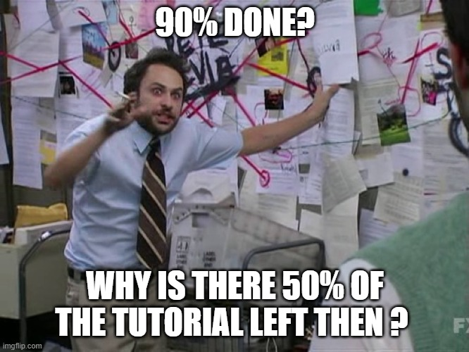

# Testing for differences between groups

This week we will be learning how to conduct an independent samples t-test. This is a statistical test that allows us to compare the means of two independent groups on a continuous outcome variable. According to the 90/10 theorem, we will spend 90% of our time wrangling and visualising our data, and 10% of our time actually conducting the t-test.

## Checking installation and loading packages

As usual we first always check and load in our required packages. 

### Activity - load packages using `library()`

Just like in Chapter \@ref(sec-testing-first-hypothesis), your script contains the code to install the packages, if required. 

> Add the two lines of code that use the `library()` function to load `here` and `tidyverse` to your own script. Run all the code.

```{r  message = FALSE, warning= FALSE}
# Check if packages are installed, if not install.
if(!require(here)) install.packages('here') #checks if a package is installed and installs it if required.
if(!require(tidyverse)) install.packages('tidyverse')

library(here) #loads in the specified package
library(tidyverse)

```

## How does where you live impact how you use social media?

In Chapter \@ref(sec-testing-first-hypothesis), we performed an analysis to learn how mood impacts active social media behaviour. However, that is not the only factor that influences social media use. For example, [Sapienza et al (2023)](https://academic.oup.com/pnasnexus/article/2/11/pgad357/7442564) found that people in rural areas are more likely to use their smartphone for social media and gaming, whereas urban dwellers are more likely to use their phone for navigation and business.

However, we do not know if people living in urban and rural areas engage with social media differently, regardless of how long they spend on their chosen platforms. Today we will address this question using the `urban`, `good_mood_likes`, `bad_mood_likes`, and `followers` variables. Remember, these variables stand for the following:

  `urban` – urban (1) or rural (2) area (based on postcode density)  
  `good_mood_likes` – average number of likes made over 10 min during a good mood (from platform + diary)  
  `bad_mood_likes` – as above, but during bad mood  
  `followers` – average number of followers across platforms  


### Activity - Formulate your research question

What do you think? Will urban and rural dwellers engage differently with social media? Why might you go on social media if you were somewhere rural compared to urban? Will there be a difference in the number of likes made by people living in urban vs rural areas? Or in the number of followers people have in urban vs rural areas?

::: {style="border-left: 4px solid #33a02c; background-color: #a6cee3; padding: 10px; margin: 10px 0;"}
<strong>Extra info:</strong> We are going to average over the effect of mood, so we do not need to include mood in our predictions about likes.
:::

> Write down your answers to the these questions as a comment in your script.

::: {style="border-left: 4px solid #33a02c; background-color: #a6cee3; padding: 10px; margin: 10px 0;"}
<strong>Question:</strong> What are the null and alternate hypothesis for your research questions (you should have one for ‘likes’ and one for ‘followers’). Write these as a comment in your script.
:::

### Activity - Load in data and check it

Today we will be averaging across mood to get the number of likes for urban and rural dwellers. This means we first need to create a new variable called `likes` which is the average of the likes in a good and bad mood.

We first load in our`PSYC2001_social-media-data-cleaned.csv` dataset. 

> Copy and paste this code into your script and run it to load in the data.

```{r }
social_media <- read.csv(file = here("Data","PSYC2001_social-media-data-cleaned.csv")) #reads in CSV files
```

Lets double check its the data we think it is by using the `head()` function. See that we've added in an argument to say we want to see the first 10 lines of the data. 

> Amend your code in your script to look at the number of rows your very own eyes want to see.

```{r check data}

head(social_media, 10) # you can even say how many lines you want to see! Try changing the number, and see what happens.
```

## Wrangling our data

There are a couple of things we need to do to get our data into shape. The first is to create our new variable `likes` which is the average of `good_mood_likes` and `bad_mood_likes`. The second is to define the urban factor correctly. More on that to come!

### Activity - Creating a new `likes` variable {#sec-new-likes}

We need to create a new variable called `likes` which is the average of `good_mood_likes` and `bad_mood_likes`. To do this, we are going to use the `mutate()` function from the `tidyverse` package. You can think of using `mutate()` as a way to create a new column in your data frame, using information from other columns.

To use `mutate()` we need to use the pipe operator `%>%` which we also used in Section \@ref(sec-get-back-on-the-pipes). The pipe operator takes the output of one function and uses it as the input for the next function. This is very useful when we want to do multiple things to a data frame in a single line of code.

We are going to use the pipe operator to take the `social_media` data frame and then use `mutate()` to create our new variable `likes`. Because we want the average likes, we will add `good_mood_likes` and `bad_mood_likes` together and then divide by 2. 

Because this is a new way of using code, we need to carefully design a test that tells us if our code is working as it should. **This is a very important part of coding.** In this case, the test is very easy to design. We can manually calculate the first few values of `likes` that our code should produce. Then, if our code does indeed produce those values, we know exactly what our code is doing. 

> Using the console (or in your head), calculate what values you should get for the first three rows of the `likes` column, when taking the average of `bad_mood_likes` and `good_mood_likes`. Add these values as comments to your script.

> Now, get the whole column of averages by running the following line of code in your script.

```{r show_mutate, eval=FALSE}

social_media_likes <- social_media %>% 
  mutate(likes =(bad_mood_likes + good_mood_likes)/2 ) # creates a new variable called likes which is the average of bad_mood_likes and good_mood_likes

```


```{r save_it, echo=FALSE}

social_media_likes <- social_media %>% 
  mutate(likes =(bad_mood_likes + good_mood_likes)/2 ) 

head(social_media_likes, 10)

```

You can see that `mutate()` has created an extra column called `likes`. 

> Check that the values in the first three rows of the `likes` column match what you calculated and added to your comments. Talk to your tutor if they do not match. 

::: {style="border-left: 4px solid #33a02c; background-color: #a6cee3; padding: 10px; margin: 10px 0;"}
<strong>Tip:</strong> Manually checking that a function has done what you think it should is a good habit to get into. It will help you catch bugs early on.
:::

Now, this data frame has all we need for our analysis, and a lot more! Let's make things simpler for ourselves by only keeping the variables we need. We can do this by once again using the pipe operator, along with the `select()` function.

> Update the code in your script so that it looks **exactly** like this:

```{r, select_variable}

social_media_likes <- social_media %>% 
  mutate(likes =(bad_mood_likes + good_mood_likes)/2 ) %>% # creates a new variable called likes which is the average of bad_mood_likes and good_mood_likes
  select(id, urban, likes, followers) # selects only the specified columns from the data frame
```

> Check that the code did indeed select only the variables we want, by using the `head()` function to check what the new data frame called `social_media_likes` looks like. 

If you need help, there is an example for how to use the `head()` function in Section \@ref(sec-data-view).

### Activity - Defining factors

Now that we have this data frame object it is important to check that R can understand the data properly. Lets use the `str()` function that we learned about in Section \@ref(sec-data-view) to examine what R thinks about each column. 

> Complete the code in your script and run it, to make sure you get the same results.

```{r}
str(social_media_likes) #provides a summary of the data structure.
```


What have we learned? We can see that R thinks that `urban` contains integers (int), i.e. R thinks that `urban` is a column of real numbers containing 1s and 2s. But `urban` is not a numeric variable, it is actually a factor (categorical variable). 

If you remember from the README.txt file (which you read already, right? :)), `1` stands for urban and `2` stands for rural. We need to tell R this, so that it can understand how to work with this variable.

To do this, we can use the `factor()` function, which converts a variable to a factor. We also need to tell R that `1` means `urban` and `2` means `rural`. 

Because we need the result to apply to every single `1` and `2` in rural, we need to use the `factor()` function along with a function that says "hey, let's apply this to the whole column". Remember how we use the `mutate()` function to make a new column? We can also apply the `mutate()` function to an existing column, as what ever you give it will be applied to every row of whichever column you name when using the function. The `mutate()` function is coming in handy today!

> Run the line of code in your script that matches this.

```{r}

social_media_likes <- social_media_likes %>% 
      mutate(urban = factor(urban, levels=c(1,2), labels=c('urban', 'rural'))) #changes the urban variable to a factor with levels urban and rural
```

Now we want to test that this code did what we wanted it to do. 

> Use the `str()` function again to check that `urban` is now a factor. 

```{r}

str(social_media_likes)
```

Excellent! We can see that R now thinks that `urban` is a factor with 2 levels: `urban` and `rural`. Our data is now in a format that we should be able to easily visualise it and conduct our statistical tests. 90% done :)

```{r, echo=FALSE, out.width="60%", fig.align='center', fig.cap="The math checks out. We promise."}

```

## Visualising our data

If you remember from Section \@ref(sec-visualised-now-what), we learned that we need to visualise our data to check if the distributions look roughly normal, and to check there are no obvious outliers or strange values that will impact our analysis.

Today, we are going to examine our variables using histograms. Just as we did in Section \@ref(sec-make-histogram). We have copied the code from Section \@ref(sec-make-histogram) below, and have added a few options into the `geom_histogram()` function so that you can get a nice looking histogram. This code is also in your script. 

### Activity - Adapting our previous code to make new histograms

Your challenge, should you choose to accept it*, is to change the code in your script so that you instead make a histogram for `likes` (`x=`) using the `social_media_likes` data frame (and not the `social_media_NA` data frame). Also remember to adjust the axis labels (the `x=` and `y=` arguments for `labs()`)!

> Change the below code in your own script to make the histogram for `likes`.

*You have to accept it. Determinism beats free will.

```{r Old code, eval=FALSE}

## health warning. This is old code that needs to be adapted for current purposes!
social_media_NA %>%
ggplot(aes(x = )) + #ggplot uses aesthetic (aes()) to map axes. 
  geom_histogram(binwidth=10, col="black", fill="seagreen") + #creates a histogram with blue fill, black borders, and a binwidth of 10
  labs(x = "Time on social media", y = "Density") + #short for "labels", use to label the axes.
  theme_classic() #changes the theme of the plot to a classic theme. makes it prettier!
```


You should get a histogram that looks something like this:

```{r, do-hist, echo=FALSE, message=FALSE}

social_media_likes %>%
  ggplot(aes(x = likes)) + #ggplot uses aesthetic (aes()) to map axes. 
  geom_histogram(binwidth=10, col="black", fill="seagreen") + #creates a histogram
  labs(x = "Rate of Likes", y = "Density") + #short for "labels", use to label axes and titles.
  theme_classic() #changes the theme of the plot to a classic theme. makes it prettier!

```

What would you say about this data, now you have looked at the histogram? Does it look normally distributed? Are there any outliers?

> Copy and paste the code you used to make the histogram for `likes` and make the teeny changes required so that you get a histogram for `followers` instead. 

Go on, you are a coder, and you are strong.

```{r, do-hist-follow, echo=FALSE, message=FALSE}

social_media_likes %>%
  ggplot(aes(x = followers)) + #ggplot uses aesthetic (aes()) to map axes. 
  geom_histogram(binwidth=10, col="black", fill="seagreen") + #creates a histogram
  labs(x = "Average Number of Followers", y = "Density") + #short for "labels", use to label axes and titles.
  theme_classic() #changes the theme of the plot to a classic theme. makes it prettier!
```


::: {style="border-left: 4px solid #33a02c; background-color: #a6cee3; padding: 10px; margin: 10px 0;"}
<strong>Question:</strong> Does `followers` look normally distributed to you? Why might the data be shaped how it is?
:::

Indeed, the `followers` variable looks different to the `likes` variable. This is not too surprising. A fewer number of people in the sample have a huge number of followers, and the rest have a more modest number. Just like in real life. Random sampling works! Ahhh, science.

Because the `followers` variable is not normally distributed, we will need to be a bit cautious when interpreting the results of our t-test later on. But we can still proceed, as the t-test is quite robust to violations of normality. You would just make sure to mention this in your write-up, so that your readers also know.

However, we would reconsider this choice if `followers` contained a massive outlier, such as if we happened to sample someone with 10 million followers. 

## Next step: descriptive statistics

Now that we know what shape our data is in, and when we should exercise caution, we can move on to generating some descriptive statistics of our key variables.

In Section \@ref(sec-get-descriptive) we learned how to summarise our data to get descriptive statistics. Now you'll get to see some more of the joy of coding - once you have written a bit of code that does something you need, its very easy to adapt it to do something else you need.

### Activity - Adapt the code to get the mean and standard deviations for likes and followers

Here is the code we wrote last week to get descriptive statistics of the rate of likes, grouped by mood:

```{r old-summary, eval=FALSE}

social_media_likes %>% 
  group_by(mood) %>% #group the data by mood
  summarise(mean = mean(likes),
            sd = sd(likes)) #calculate the mean number of likes

```

We want to use this code as a template for ourselves, so that we can get the mean and standard deviation for `likes` and `followers`, this time grouping by `urban`. 

> You will find the below code in your script. Complete it to get the descriptive statistics for likes and followers.

```{r social_descriptives, eval=FALSE}

social_media_descriptives <- social_media_likes %>% # save to new object called social_media_descriptives
  group_by(???) %>% # group the data by urban
  summarise(
    mean_followers = mean(followers), # calculate the mean number of followers for urban and rural groups separately
    mean_likes = mean(likes), # same for likes
    sd_followers = sd(???), # calculate the sd of followers
    sd_likes = sd(???) # calculate the sd of likes
  )

social_media_descriptives
```

> Check that your output for `social_media_descriptives` looks like this:

```{r social_descriptives_reals, echo=FALSE}

social_media_descriptives <- social_media_likes %>% # save to new object called social_media_descriptives
  group_by(urban) %>% # group the data by urban
  summarise(
    mean_followers = mean(followers), # calculate the mean number of followers for urban and rural groups separately
    mean_likes = mean(likes),
    sd_followers = sd(followers), 
    sd_likes = sd(likes)
  )

social_media_descriptives
```

> Look at the mean values you have generated for urban and rural dwellers. Are they what you expected? Do they fit with your predictions from earlier?

## Independent samples t-test

Now we are down to the very last few percents of our 10% of analysis efforts. Let's perform some independent samples t-tests to see if there are statistically significant differences between urban and rural dwellers in terms of their `likes` or `followers`.

### Activity - Performing independent samples t-tests {#sec-formula-for-independence}

In Section \@ref(sec-conducting-paired-t-test) we learned how to conduct a paired samples t-test. To do this, we had to deal with niggly base R demands and use the wideform data instead of our carefully wrangled longform data. Fortunately, the `t.test()` function is a bit more forgiving when it comes to independent samples t-tests, and we can use our longform data combined with a nifty thing that base R knows about, which is formulas. Huzzah.

This is how we use the formula method in `t.test()`. The syntax is `t.test(DV ~ IV, data = data frame)`. So, for our data, we want to test if the dependent variable (DV) `likes` differs by the independent variable (IV) of group that is coded in `urban`, using the `social_media_likes` data frame. 

Note that you don't need to set the `paired` argument to `FALSE`, as the `t.test()` function assumes this whenever you use the formula method. So never use the formula method for a paired samples t-test. That would be a disaster.

> Run the below line of code in your script, to check you get the same output. 

```{r, independent}

t.test(likes~urban, data=social_media_likes) # conducts an independent samples t-test to see if likes differ by urban/rural status

```


> What does the output of the independent t-test tell you about the differences between urban and rural dwellers and how they actively use social media? Is it what you expected when you formulated your hypothesis? Write a comment in your code that interprets your result in the context of your hypothesis.

> What do the 95% CIs tell you about the mean difference between urban and rural dwellers in terms of likes? Write a comment in your code that interprets this.

Is there a piece of extra information you would like to know about the difference between groups that is not provided in the output for the independent t-test? If you are unsure, ask your tutor. If you are, calculate the missing piece of information and add it as a comment in your code.

> Now complete the following line of code in your own script, to test if `followers` differ by `urban`. 

```{r, mock_t, eval=FALSE}

t.test(???~urban, data=social_media_likes) # conducts an independent samples t-test to see if followers differ by urban/rural status
```

> Check your output with what you see below to make sure you got it right. Also, make sure to interpret what the output is telling you!

```{r, real_t, echo=FALSE}

t.test(followers ~ urban, data = social_media_likes)
```


```{r, echo=FALSE, out.width="50%", fig.align='center', fig.cap="We have all been there."}
knitr::include_graphics("images/Testing_between_groups/Exams-hard.jpg")
```


## Writing up results and conclusions

This is how we would write up the results of an independent samples t-test.

::: {style="border-left: 4px solid #33a02c; background-color: #a6cee3; padding: 10px; margin: 10px 0;"}
<strong>Results:</strong> An independent samples t-test indicated that the mean number of likes was greater for rural (<i>M</i> = 52.1 , <i>SD</i> = 12.7) compared to urban dwellers  (<i>M</i> = 40.8 , <i>SD</i> = 14.5) and this difference was statistically significant (<i>t</i>(58) = 3.22, <i>p</i> = 0.002). Conversely, the mean number of followers was greater for urban (<i>M</i> = 143.9, <i>SD</i> = 62.0) than for urban dwellers (<i>M</i> = 105.6, <i>SD</i> = 40.9) which was statistically significant (<i>t</i>(58) = 2.82, <i>p</i> = 0.007).
:::

### Activity - Visualising group differences

If you have made it this far with time to spare, then kudos. Here are some extra skills that will be very helpful when you need to present results relating to group differences. 

Earlier, we looked at the overall histograms for `likes` and `followers`. But when presenting our findings in a results section, what the reader really wants to see is how the groups differ from each other. One effective way to do this is to make a grouped boxplot. See [here](https://www.simplypsychology.org/boxplots.html) for more details on boxplots.

Let's make a boxplot, showing the `likes` data split by `urban` and `rural` groups. We are going to use a couple of new functions here (`geom_boxplot()`, `scale_fill_manual()`), which we explain in the comments below.

```{r, boxplotlikes}

social_media_likes %>% 
  ggplot(aes(y = likes, group=urban, fill = urban, x = urban)) + # here we are telling ggplot that we will be putting likes
  # on the y axis, that we will fill in our boxplots with colour using the urban factor, and that urban will go on the x-axis
  geom_boxplot() + # this function creates a boxplot
  labs(x = "Living Area", y = "Average Rate of Likes") + # here we use labs() to label our axes.
  scale_fill_manual(values = c(rural = "plum", urban = "cyan2")) + #manually define the filled in colours of specific parts of a graph - see here for more R colours: https://r-graph-gallery.com/42-colors-names.html
  theme_classic() 

```

Now we return to another critical part of coding. Copying and pasting what you have, and changing just a few bits. 

> Copy and paste the code above and change it to make a boxplot for `followers` instead of `likes`. 

You will need to change what you give for the `y` argument in `aes()`, and the y-axis label. You can also change the colours if you want to. A list of colours that can be used can be found [here](https://r-graph-gallery.com/42-colors-names.html).One you have finished, you should get something that looks like this:

```{r, follow_bp, echo=FALSE}

social_media_likes %>% 
  ggplot(aes(y = followers, group=urban, fill = urban, x = urban)) + 
  geom_boxplot() + # this function creates a boxplot
  labs(x = "Living Area", y = "Average Followers") + 
  scale_fill_manual(values = c(rural = "magenta4", urban = "aquamarine4")) + 
  theme_classic() 
```

Last, we often want to save our figures as image files, so that we can include them in reports or presentations. This is very easy to do using the `ggsave()` function. 

First, you should save the plot you want to save to an object. 

> Amend your boxplot code so that the output saves to an object, such as you see below.

```{r, likes_save, eval=FALSE}

likes_bp <- social_media_likes %>% 
  ggplot(aes(y = likes, group=urban, fill = urban, x = urban)) + 
  geom_boxplot() + # this function creates a boxplot
  labs(x = "Living Area", y = "Average Rate of Likes") + # here we use labs() to label our axes.
  scale_fill_manual(values = c(rural = "plum", urban = "cyan2")) + 
  theme_classic() 

```

> Also amend your code for the `followers` boxplot so that it is saved to an object called `followers_bp`. Run the code and check the new object appears in the list in your Environment pane.

Then, you can use the `ggsave()` function to save the plot to a file. The syntax is `ggsave("filename.png", plot = plot_name)`. You can change the file extension to save in different formats (e.g., .jpg, .pdf). We want to be extra smart and save the file to our `Output` folder, so we will use the `here()` function to specify the path.

> Copy and paste this code to your script, and run it. Then check the contents of the 'Output' folder.

```{r, save_figure, eval=FALSE}

ggsave(here("Output", "likes_boxplot.png"), plot = likes_bp) # saves the likes boxplot to the Output folder as a PNG file

```

> Now copy and paste that, and change it so that you save your `followers_bp` plot instead of the `likes_bp` plot.

## You are Free!

Well done! This computing tutorial is now over. You have done your research.

```{r, echo=FALSE, out.width="50%", fig.align='center', fig.cap="You can. You are a scientist now."}
knitr::include_graphics("images/Testing_between_groups/do_your_research.gif")
```

## ⭐ Bonus exercises 

If that just wasn't enough, then here are some extra coding challenges to defeat...


### Bonus Activity - new variable!

> Create an extra variable called `engagement` which is the ratio of `likes` and `followers`. Then get the descriptive statistics for this new variable, grouped by `urban`. 

What can you learn about the distribution of this new variable? Can you analyse it by adapting the code from this session?

### Bonus Activity - Visualising group means

Before, we made boxplots to show the group differences between urban and rural dwellers. Boxplots are great, because they provide a good summary of the spread of the data. However, we make inference regarding the difference between group means, rather than the medians, and it is the group medians that the boxplots show. As the mean can be different to the median when the data are skewed, it can be helpful to add a point showing each group mean on top of the boxplots.

> Can you amend your code for your boxplots by using the [`stat_summary()`](https://ggplot2.tidyverse.org/reference/stat_summary.html) function?

### Bonus Activity - Tracking bugs

Here we will have a go at identifying when code has not worked perhaps as we thought it would. This challenge is a little fiendish, but I am sure you can do it.

> Copy the following line of code into your script and run it. You should see the same data as below. Can you work out what went wrong with the `new_likes` variable?

Can you write the code that proves what is wrong?

```{r, surprise, eval=FALSE}

social_media %>% 
  mutate(new_likes = mean(c(good_mood_likes, bad_mood_likes)))

```

```{r, surprise peek, echo=FALSE}

head(social_media %>% 
  mutate(new_likes = mean(c(good_mood_likes, bad_mood_likes))), 10)
```

Bug defeated? Achievement unlocked! 

### Bonus Activity - Build a script from scratch

We sneaked an extra file into your Data folder called `Tutorial_4_exercise_1.csv`. It contains the data from your stats tutorial, where you calculated a t-test by hand.

Can you make a new script that loads the data, checks it, and performs an independent samples t-test on the data? Match the values from the output `t.test()` to the values you calculated by hand.

Extra smugness is available if you can also make a boxplot showing the group differences, and save the figure to your Output folder.
