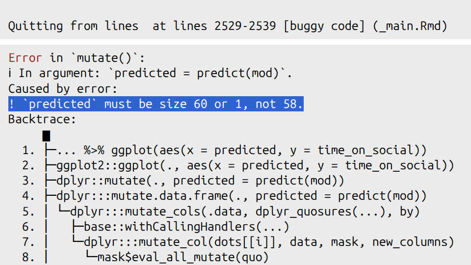

# Making predicitions using Linear Regression {#linear-regression}

This week, we are going to continue to explore relationships between continuous variables, using simple linear regression.

## Checking installation and loading packages

As usual we first always load in our required packages `here` and `tidyverse`.

### Activity - load the packages!

> Find the code from a previous week that loads the packages `here` and `tidyverse`. Copy it to your script and run the code.

```{r message = FALSE, echo=FALSE, warning= FALSE}

library(here) #loads in the specified package
library(tidyverse)

```


## Investigating linear regressions

Last week we looked at the correlation between  social media use, age and political attitude. We created a composite score to measure overall political attitude, and we saved a data set that contains the new score.  

Today we will be using a simple linear regression to determine the extent to which political attitude can predict the amount of time spent on social media.

Here is a recap of the variables:

  `id` - participant ID  
  `age` – age in years  
  `time_on_social` – average hours/day on social media (self-report diary)  
  `polit_attitude` - political attitude score composed of a weighted sum of the subsales `informed`, `campaign` and `activism`  

### Activity - Formulate your prediction about predictions

Before we begin coding, let's think about our research question. We learned last week that there is a statistically significant correlation between political attitude and time spent on social media. This tells us that we should be able to somewhat predict time spent on social media from political attitude.

What do you think the nature of this predictive relationship will be? Will political attitude positively or negatively predict time spent on social media? How much of the variance in time spent on social media would you expect to be predicted by political attitude?

> Write in the comments of your code whether you expect a positive or negative relationship, and if you are feeling statistically empowered, what proportion of variance of time spent on social media you would expect to be accounted for by political attitude.

::: {style="border-left: 4px solid #33a02c; background-color: #a6cee3; padding: 10px; margin: 10px 0;"}
<strong>Question:</strong> What is a reasonable null and alternate hypothesis? Add this to the comments in your code.
:::

### Activity - loading the data set

First, we need to load our data set for today. This week we will be using the  `PSYC2001_social-media-attitude.csv` data set which includes the `attitude` variable we created last week.  

> Copy the code you have used to load the data in previous weeks, and paste it into your script. Amend the code so that you are loading the correct data set for today. Make sure you assign it to an object named `social_media_attitude`. Check the data set is as you think by running the line of code `head(social_media_attitude)`.

```{r, load data, echo = FALSE }
social_media_attitude <- read.csv(file = here("Data","PSYC2001_social-media-attitude.csv")) #reads in CSV files
```

## Let`s get the data into shape for some viz

Before fitting the regression, let’s look at the distributions of our key variables using density plots, similar to as we did in Section \@ref(sec-get-back-on-the-pipes). Remember, visualising first helps us spot outliers and get a feel for the data—remember: __garbage in, garbage out__. We’ll reuse the same tidy workflow you used back then: we will select() the columns we need, pivot_longer() into longform, then make density plots.

### Activity - select and pivot to longform

The goal: move the values from `time_on_social` and `polit_attitude` into one column and keep a second column that labels which variable the value came from.

> Run the following code in your script to see what it does to the data frame.

```{r, make_long, eval=FALSE}


# Choose the columns, then pivot to longform
social_media_attitude %>%
  select(id, time_on_social, polit_attitude) %>% # choose columns
  pivot_longer(                                   # go from wide -> long
    cols = c(time_on_social, polit_attitude), # the two key measures
    names_to  = "measure",                    # which measure is this value from?
    values_to = "value"                       # the numeric value itself
  )

```

Now, we want to save this new longform data frame so that we can use it to make us some density plots

> Assign the new data frame to an object called `sma_long`. Check the result by running the line of code that says `head(sma_long)`

Here, 'sma' stands for 'social_media_attitude'. We shortened the name in a meaningful way to make it easier to type, and to make it easier to follow the code. (The shortening is meaningful because we can still tell what the object is about when it is called `sma_`!)

You should see the following:

```{r, make_long_4rls, echo=FALSE}


# Choose the columns, then pivot to longform
sma_long <- social_media_attitude %>%
  select(id, time_on_social, polit_attitude) %>% # choose columns
  pivot_longer(                                   # go from wide -> long
    cols = c(time_on_social, polit_attitude), # the two key measures
    names_to  = "measure",                    # which measure is this value from?
    values_to = "value"                       # the numeric value itself
  )

head(sma_long)

```

::: {style="border-left: 4px solid #33a02c; background-color: #a6cee3; padding: 10px; margin: 10px 0;"}
Helpful fact: In the longform data frame, each participant now has two rows (one for `time_on_social`, one for `polit_attitude`). 
:::

The eagle-eyed among you will have noticed that R is calling your new data frame a 'tibble'. Tibbles are a special type of data frame that are part of the `tidyverse` package. They have some nice features that make them easier to work with than regular data frames, such as better printing and subsetting. Don't worry too much about tibbles for now, but just know that they are bascially a data frame, and that everything you know about data frames applies to tibbles.

### Activity - examining distributions with density plots

Now we want to plot both the `polit_informed` and `time_on_social` variables as density plots. As we have already written code to make a density plot in Section \@ref(sec-densities), let's take that code and adapt it for our current purposes. That code is below (which will also be found in your script).

> Amend the below code so that we can use it with the object `sma_long` instead of `social_media_likes`. Change the code so that `x =` takes the `value` column instead. Remove the `group` and `fill` arguments as we don't have groups in our data right now.

```{r, eval=FALSE}

social_media_likes %>% 
  ggplot(aes(x = likes, group = mood, fill = mood)) + # set canvas aesthetics 
  geom_density() # use the data to draw a density plot 

```

When you are done, you should have something that looks like this:

```{r, echo=FALSE, warning = FALSE}

sma_long %>%
  ggplot(aes(x=value)) + # set the aesthetics
  geom_density() # do the density plot

```

Now, this is no good, as we have a density plot of the variable `value` which contains the rows for both the `polit_attitude` and `age` values. And we want separate density plots, one for `polit_attitude` and one for `age`. We need to tell `ggplot` to separate them! 

Luckily, there is a very handy function called `facet_wrap()` that will do this for you.

`facet_wrap` is your friend. To use the `facet_wrap()` function, we use the formula method, but we only need to put something on the right hand side, and that something is the name of the variable that we want to split up the plots by. 

> Add the piece of code `+ facet_wrap(~measure)` to your existing code you wrote to plot the density of the data. Run the code. You will know you have succeeded when you behold the same plot as below.

```{r, echo=FALSE, message = FALSE}

sma_long %>%
  ggplot(aes(x=value)) + # set the aesthetics
  geom_density() + # do the density plot 
  facet_wrap(~measure) # make a separate plot for each measure
```

Excellent. We have plots. 

::: {style="border-left: 4px solid #33a02c; background-color: #a6cee3; padding: 10px; margin: 10px 0;"}
<strong>Question:</strong> Would you say the variables are normally distributed? What values for `polit_attitude` and `time_on_social` are more likely and which are less likely? Do these values seem sensible, given the scales for political attitude (0-7), and your experiences with social media?
:::

> Write your answer to the questions above as a comment in your code

## Linear regression in R 

The difference between a regression and correlation is that instead of looking for a statistical relationship between $x$ and $y$, we are asking how well we can predict $y$ on the basis of $x$. $x$ is our predictor variable, and $y$ is what is being predicted, which we refer to as our criterion variable or our dependent variable (DV). Running a regression is like asking "if we were stuck on a desert island with only $x$, how much would we know about what $y$ is doing?" 

### Activity - fitting a linear regression model

Let's run a simple linear regression to determine how well political attitude predicts the amount of time spent on social media. To do this we can we can fit a linear regression model using the `lm()` function.

> In the console, use the `?` syntax to look up the help documentation for the `lm()` function. Write in your comments the first two arguments required for this function, and your guess as to what each argument is asking for. **Hint:** scrolling down to look at the examples may help you work it out. 

You need to complete the unfinished comment in your code that looks like this:

```{r commentA}

# 1. the first two arguments for lm() are...

```

The first argument is `formula`, which is where we specify the dependent and independent variables in our regression. We have already used formulas in Sections \@ref(sec-formula-for-independence) and \@ref(sec-cor-form). In fact, the formula we need looks very similar to the one in Section \@ref(sec-formula-for-independence), except that we now have a different DV (or criterion), and a continuous predictor rather than a categorical IV.

> Write in the comments of your code the formula that you will need to predict the time spent on social media from political attitude scores.

Complete the unfinished comment in your code that looks like this:

```{r commentB}

# 2. the formula I need to use is ... 

```

The second argument is `data`, which, just like in Section \@ref(sec-formula-for-independence), is where we specify the data frame that contains our variables.

> Complete the following line of code in your script, so that you are fitting a linear regression model that predicts `time_on_social` from `polit_attitude`, using the data frame `social_media_attitude`. The code is writted so that it assigns the output of the model to an object named `mod` (which is short for model).

```{r, to_fill_out, eval=FALSE}

mod <-lm(formula = ... ~ ..., data = ... ) 
```

```{r, lm_for_real, echo=FALSE}

mod <- lm(formula = time_on_social ~ polit_attitude, data = social_media_attitude ) # time_on_social is on the left side of the tilde as it is being predicted by attitude 
```

The first thing we should do is look at what the `lm()` function passed to our object `model`.

> Run the following line of code in your script to see what was saved to the object `mod` by the `lm()` function.

You will see what has been saved to the object `mod`.

```{r, mod contents}

mod

```

You can see that there is a documentation of how `lm()` was used (After 'Call:'). It can be good to check this so that you can be sure you ran the correct model.

After that, there are two coefficients output. The first is the Intercept (which we have referred to as $a$ in the lectures). The second is the slope of the regression line (which we referred to as $\mathrm{Beta}$ in the lectures).

> Use the two coefficients to write a regression equation that predicts time spent on social media on the basis of political attitude in the comments in your code. Is the regression coefficient positive or negative? Is this what you expected?

### Activity - how good is our model?

We are able to make predictions about time spent on social media using the regression equation we have just created. But we are yet to find out how good our model is at making these predictions. For this, we need to extract the $R^2$ value, and determine whether our model predicts variance to an extent that is greater than what is expected by chance.

Luckily, R has a helpful `summary()` function that will take a linear regression as its input, and it will output us lots of useful information about the regression model.

> Run the following line of code in your script and examine the output of the `summary()` function, which appears in the console.

You should see a table that looks like this:

```{r}

summary(mod)

```


> Identify the $R^2$ value in the output of the `summary()` function, and write it in the comments of your code. Further, identify the F statistic, degrees of freedom and p-value associated with the overall model fit, and write these in the comments of your code too. Finish with a brief comment about whether the result is as you expected or not.

**Note**: R refers to the $R^2$ value as 'Multiple R-squared' which is not the technically correct name when there is only one predictor in the model (the technically correct name is 'R-squared'). R is just covering its bases here, assuming that one day you will have multiple predictors (PSYC3371, anyone?) and thus using the term 'Multiple R-squared' covers all the cases there might be, including the particular case of R-squared.

::: {style="border-left: 4px solid #33a02c; background-color: #a6cee3; padding: 10px; margin: 10px 0;"}
<strong>Info:</strong> There are additional statistics that are output from the `lm()` model. We can leave them for future us at this point, but if you always need to unwrap your gifts immediately then you can read this blog [here](https://feliperego.github.io/blog/2015/10/23/Interpreting-Model-Output-In-R) to find out more.
:::

## Writing up results and conclusions

This is how you would write up the results of the linear regression we have just conducted. 

::: {style="border-left: 4px solid #33a02c; background-color: #a6cee3; padding: 10px; margin: 10px 0;"}
<strong>Results:</strong> A simple linear regression was performed to evaluate the extent that political attitude predicted the amount of time spent on social media. It was found that political attitude predicted the amount of time spent on social media to an extent that was statistically significant ($F$(1,56) = 19.95, $p$ < .01, $\mathrm{R}^2$ = 0.26).
:::

## Plotting our results

To show how well a simple linear regression captures the relationship between two variables you should include a straight line of 'best fit' on a scatterplot. This is incredibly useful at visually informing the reader of the linear predictive relationship between variables. (Un)Surprisingly, most people (including researchers) are quite bad at guessing the strength of linear relationships using scatterplots alone !

### Activity - Adding a line of best fit to a scatterplot

The line of best fit can easily be added to a `ggplot` graph by using the `geom_smooth` function. Below, we have pasted the code that plotted the scatterplot of political attitude against time spent on social media from last week, in Section \@ref(sec-scatterplots). We have added one extra line of code that adds the line of best fit to the plot. Can you spot it?

```{r warning= FALSE, message = FALSE}

social_media_attitude %>% 
  ggplot(aes(x = polit_attitude, y = time_on_social)) + # set up the canvas
  geom_point(colour = "orange") + # make a scatterplot
  geom_smooth(method = "lm", se = TRUE) + # add line of best fit and ...
  labs(x = "Political Attitude", y = "Time on Social") + # define axis labels
  theme_classic() # make pretty

```

> Use the `?` operator to look up the help documentation for `geom_smooth()`. Find out what the `se =` argument stands for, and finish the comment in your code with a description of what it does. 

> Run the code in your script to get the below plot. Is the line where you thought it would be?

### Activity - level up

You will also see in the help documentation that there is an argument called `level =`. 

> Add it to the call for `geom_smooth()`, setting it to `level = 0.95`. Remember to make sure there is a comma between the last argument and this one. Run the code again. What has changed about the plot? Now change the `level =` argument to some other number (other than 0.95). Run the code again. What has changed now? 

> Add to the comment in your code what the `level()` argument does.

## You are Free!
  
Well done folks, you have survived another computing tutorial. If you are unsure about any of the contents then your friendly local tutor is here to help!

```{r, echo=FALSE, out.width="50%", fig.align='center', fig.cap="It almost over (I promise)"}
knitr::include_graphics("images/Linear_regression_in_R/Done.jpg")
```

## ⭐ Bonus exercises 

Are you ready for the challenge of the very last bonus exercises?

### Bonus Activity - Tidying up the Scatterplot

I don't know about you, but the default theme for the line of best fit smites my eyes.

> Can you alter the colours of the line of best fit and the shaded area so that it fits better with the colour scheme of the rest of the plot? Can you find some examples of how to do this on stackoverflow.com, or can an LLM help you find the answer?

### Bonus Activity - Visualising the line of best fit for Urban and Rural participants on separate plots

It could be useful to know whether the predictive relationship between political attitude and time on social is comparable for Urban and Rural participants. 

> Can you amend your code for the scatterplot with the line of best fit, so that the plots for Urban and Rural participants are shown on separate panels? 

**Hint:** You have already used the function that will do this for you earlier in this section.

For an extra level up, can you change the aesthetics so that the points are coloured by `urban` (Urban or Rural), and the line of best fit is also coloured by `urban`?

### Final Bonus Activity - Can you fix the bug to make this code work?

This one is fiendish! Below is a block of code that is supposed to create a scatterplot of the Observed vs Predicted values from our linear regression model. The code has been commented so that you can understand what it is trying to do. However, there is a bug in the code that is stopping it from working.


```{r, buggy code, eval=FALSE}


# Activity – Observed vs predicted plot
social_media_attitude %>% # take the data frame 
  mutate(predicted = predict(mod)) %>% # create a new column that contains the predicted value for each participant
  ggplot(aes(x = predicted, y = time_on_social)) + # set up the canvas
  geom_point(alpha = 0.6) + # make a scatterplot, and make the dots kinda seethrough
  geom_abline(slope = 1, intercept = 0, colour = "red", linetype = "dashed") + # add a 45 degree reference line. If predictions were perfect, all points would fall on this line
  labs(x = "Predicted", y = "Observed") +  # define labels
  theme_classic() # make pretty
```


If you run this code you should get the following error message. The important part for working out this bug is highlighted for you.

```{r, echo=FALSE, out.width="50%", fig.align='center', fig.cap="The fiendish bug lies therein"}

```

The other clue I will give you is that you can check how many rows are in a data frame by using the `nrow()` function. For example, if you run the line of code `nrow(social_media_attitude)`, you will see how many rows are in that data frame. (You can also look at `social_media_attitude` in the Environment pane in RStudio to see how many rows it has).

The very last clue is in Section \@ref(sec-pipey).

OK, the last last clue is that there is a `tidyverse` function that will help you.

Good luck!


