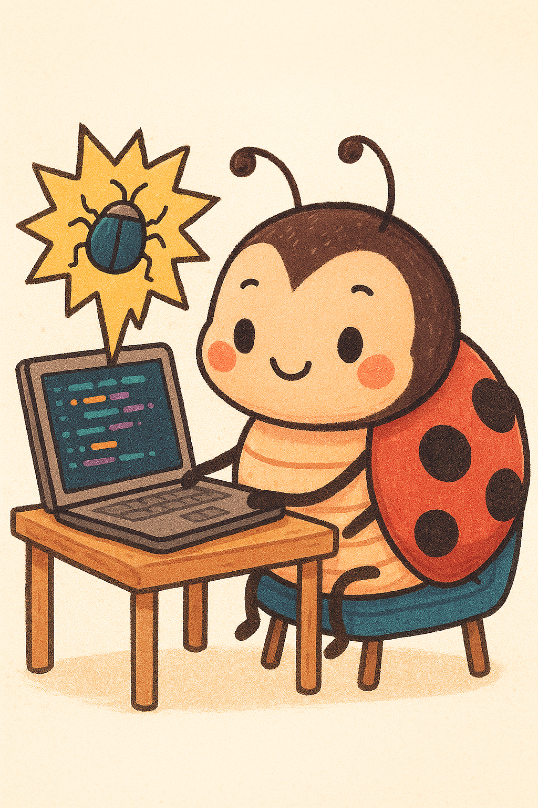

--- 
title: "Data Analysis Skills for Psychology in R"
author: "Kelly G. Garner, Bart Cooley, Marios Panayi, Peter Lovibond"
date: "`r Sys.Date()`"
site: bookdown::bookdown_site
documentclass: book
bibliography: [book.bib, packages.bib]
biblio-style: apalike
url: https://garner-code.github.io/PSYC2001_ComputingLabBook/
cover-image: images/cover_temp.png
description: |
  This book contains the complete guide for computing tutorials for PSYC2001 at UNSW.
link-citations: yes
github-repo: https://github.com/garner-code/PSYC2001_ComputingLabBook # KG change this
---

# Course Information {-}

## The purpose of this coursebook

Welcome to the computing tutorials for PSYC2001. This coursebook has been designed to support your learning of statistics through hands-on practice with R. It accompanies the lab tutorial folders available on Moodle, and will guide you step-by-step through the data analysis components of the course. The focus is not just on memorising, but on learning how to think about data, ask good questions, and use R as a tool to answer them. 

## Structure of the Coursebook

Each chapter introduces a key concept in statistics. You will see worked examples with code that runs in R. These examples show you how to apply data analysis and statistical techniques, step by step. Throughout the chapters, you will find exercises to help you complete code in your own scripts. Completing the code in your own scripts is important, because you will need these coding skills to complete your assignment for the course, and beyond! Throughout this course book there will be questions that encourage you to think about about or apply what you've learned in new situation. 

## Bugs are important

Learning to code involves making lots of errors. When a piece of code doesn't work, it's because you have a 'bug' in your code. This can feel disheartening at first, because we often think that bugs are a sign of failure. But bugs are actually an important part of learning to code. They help you to understand how the code works, and they help you to learn how to debug your code. So, don't be afraid of bugs! Embrace them as part of the learning process. In fact, once you've been coding long enough, you'll become deeply suspicious when you don't find bugs.

```{r img-bugs, echo=FALSE, fig.align='center', fig.cap="Remember, we like bugs! They help us solve the issues with our code (Image courtesy of Copilot)", echo=FALSE, fig.align='center', out.width="50%", out.height="50%"}



```

## Big unknowns and little unknowns

When learning about statistics and data analysis, you are often encountering lots of information about multiple different things for the very first time, such as p-values, statistical tests, and how software works. Sometimes, when learning to code a new analysis, it can be hard to know if your code isn't working because you have missed something large and conceptual (a big unknown), or whether you have a bug in your code, such as a typo (little unknown). This course book aims to explain when you should be thinking about big unknowns (research questions), so that the rest of the time you can focus on the little unknowns during your computing labs. 

Solving little unknowns (fixing bugs) often requires reading your code very carefully, to check it matches the examples provided. You should also test what each little piece of code does, by checking what it takes as an input, and how it transforms the input into an output. How to do this will become clearer throughout the course, as we show you plenty of examples of how to do this.

## Setting up R and RStudio

All of the UNSW School of Psychology computers have R and R Studio installed, so you can use R and RStudio on those computers during your computing labs.

Both R and RStudio are freely available so you can also install them on your own machine. There is a useful [guide to installing them both here](https://psyteachr.github.io/hack-your-data/r_instructions.html) that you can use. If you have specific technical issues getting R and RStudio installed on your own laptop, then check the course moodle on how to get help. 